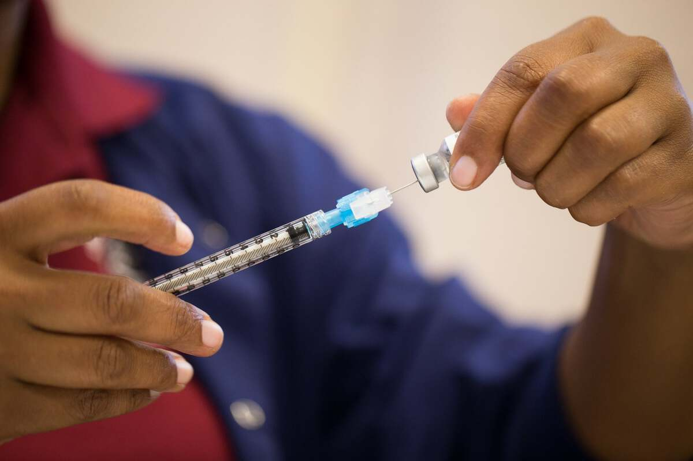

🧠 Project Title
.

# Who Gets Vaccinated? Machine Learning Predictions of H1N1 and Seasonal Flu Vaccine Uptake

Author : Winnie Amoit

## Overview
This project builds a machine learning model to predict the probability that individuals received the 2009 H1N1 and seasonal flu vaccines based on survey data. The solution is framed as a multi-label probabilistic classification task.

By understanding vaccine hesitancy patterns, public health institutions can better target at-risk populations and craft data-driven intervention strategies.

## Objectives
Predict likelihood of H1N1 and seasonal flu vaccination.

Profile vaccine-hesitant populations.

Enable targeted health messaging.

Support proactive policy-making in future pandemics.

 ## Stakeholders
Public Health Authorities (e.g., CDC, WHO)

Healthcare Providers & outreach programs

Researchers in epidemiology & behavioral science


## Tools & Technologies
Languages: Python

Libraries: pandas, numpy, scikit-learn, matplotlib, seaborn

Models: Logistic Regression, Random Forest, Grid Search, Feature Selection

Techniques: Preprocessing pipelines, One-Hot/Ordinal Encoding, ROC AUC, PR-F1 metrics, Feature Selection


## Dataset
training_set_features.csv

training_set_labels.csv

test_set_features.csv

These datasets contain demographic, behavioral, and health-related survey data from 2009 related to vaccine uptake.
You can download the datsets from [datadriven.org](https://www.drivendata.org/competitions/66/flu-shot-learning/).


## Modeling Process
Data Cleaning & Preprocessing

Imputation of missing values

Encoding categorical features

Feature scaling

## Model Training & Evaluation

Logistic Regression & Random Forest

GridSearchCV for hyperparameter tuning

ROC AUC & PR-F1 as primary evaluation metrics

## Feature Selection

Used SelectFrom Model to identify key predictors

## Prediction

Generated probabilistic outputs for each label

## Results
AUC and F1 scores used for model evaluation.

Key features identified influencing vaccine uptake.

Visualizations provided for feature importance and data distribution.

## 🤖 Final Model Selection

After evaluating both **Logistic Regression** and **Random Forest**, we selected **Logistic Regression** as the final model due to:

- Comparable performance to Random Forest
- Superior interpretability and simplicity
- Faster inference time, ideal for deployment

---

## 📊 Model Performance (Validation Set)

| Metric               | H1N1 Vaccine | Seasonal Vaccine |
|----------------------|--------------|------------------|
| **Accuracy**         | ~77.7%       | ~77.4%           |
| **ROC AUC Score**    | 0.835        | 0.850            |
| **F1 Score**         | 0.68–0.76    | 0.75–0.76        |


# ✅ Recommendations

1. **Targeted Campaigns**: Focus on individuals without provider recommendations.
2. **Behavioral Insights**: Use concern about illness as an entry point for education.
3. **Improve Communication**: Emphasize physician engagement in vaccination discussions.
4. **Proactive Modeling**: Apply similar methods to forecast hesitancy for future vaccines.


## Next Steps
Integrate model interpretability tools (e.g., SHAP, LIME).

Develop a web-based dashboard for real-time use.

Extend model to new datasets (e.g., COVID-19 hesitancy).

Incorporate ensemble or deep learning models for performance benchmarking.

## Files in This Repo
- Predicting-Vaccine-Uptake/notebook.ipynb
- Predicting-Vaccine-Uptake/Readme.md
- Predicting-Vaccine-Uptake/Who Gets Vaccinated.pdf : Slide deck for stakeholders
- Predicting-Vaccine-Uptake/submission.csv
- Predicting-Vaccine-Uptake/test_set_features.csv
- Predicting-Vaccine-Uptake/training_set_features.csv
- Predicting-Vaccine-Uptake/training_set_labels.csv
- Predicting-Vaccine-Uptake/requirements.txt
- Predicting-Vaccine-Uptake/flu-vaccine.jpg : Image for Readme.md

## File Structure
Predicting-Vaccine-Uptake/
-├── README.md
-├── requirements.txt
-├── training_set_features.csv, training_set_labels.csv, test_features.csv/
-├── notebooks/
-│   └── notebook.ipynb
-├── outputs/
-│   ├── Dashboard.pdf
-│   └── Presentation.pdf
 -   |__ Submission.csv


## 📌 How to Run

```bash
# Clone the repo and install dependencies
pip install -r requirements.txt

# Launch notebook
jupyter notebook notebook.ipynb
```

## Interactive Tableau Dashboard

  

## Acknowledgements
Thanks to the DrivenData H1N1 Vaccine Prediction competition for the dataset and problem framing.


## Questions?
Feel free to reach out or submit issues in this repo!